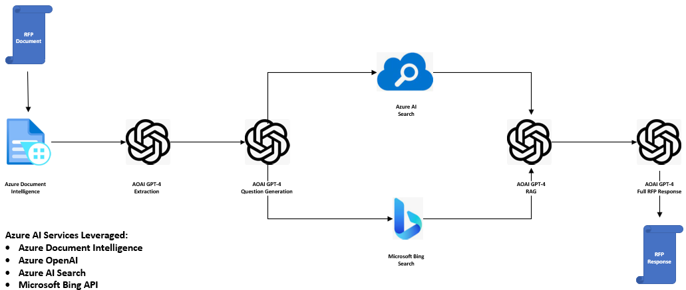

# Automated RFP Responses with GPT-4

    
    

LLMs have unlocked use cases in almost every industry due to the wide range of tasks they are capable of performing. In the **Professional Services / Consulting** industry, LLMs are being leveraged for two main use cases:
1. QnA chatbots with Retrieval Augmented Generation (RAG) implemented on the company's internal knowlege base for leveraging AI to increase the productivity of field consultants in their client engagements. 
2. LLM apps to automate the generation of Request For Proposal (RFP) responses as well as other deliverable that the consultants deliver on a daily basis.

This repository explores the second use case in detail and demonstrates how automated RFP responses can be orchestrated with LLMs like GPT4. Azure AI Stack is heavily leveraged in the process with the following services being utilized: 
1. **Azure Document Intelligence Service** - For document cracking and extracting the text content from the RFP document. 
2. **Azure OpenAI Service** - GPT-4 is used at multiple steps in the process including extraction, research questions generation, retrieval augmented generation and final rfp response generation. 
3. **Azure AI Search** - For retrieval of relevant content from the internal search platform to answer the research questions previously generated. 
4. **Microfoft Bing Service** - For retrieval of any relevant content from the internet to answer the research questions previously generated. 

## Flow
The *rfp_automation* notebook walks through the rfp generation process in detail. It uses a technique called Plan and Solve (PS) prompting to break down the generation process into smaller steps by extracting enough details in the plannings steps before requesting GPT-4 to solve the problem at hand with Retrieval Augmented Generation (RAG). The plan and solve approach used can be broken down into the following steps: 
1. RFP pdf is processed by the Azure Document Intelligence service and converted into text. 
2. The rfp text is processed by GPT-4 and the scope of work, required deliverables, evaluation criteria and other details extracted from the text.
3. Another request is sent to GPT-4, this time to generate pertinent questions that must be answered in the RFP response that will demonstrate the responding service provider's experience and capabilities in the services being requested in the RFP.  
4. Search is performed, on both internal knowledge base with Azure AI Search and on internet data with Microsoft Bing Search API, for each one of the questions generated in the previous step and the results saved in an in-memory vector database

   - Note: For the purposes of this demo, due to a lack of an internal knowledge base, internet search through Bing is used to implement the RAG process.

5. Using the search results from the previous step, Retrieval Augmented Generation is implemented on each one of the originally generated questions. 
6. The answers generated in the previous step are augmented and sent back to the LLM for finally putting everything together and generating a full RFP response.

## Prerequisites
* Azure subscription.
* Accepted Application to Azure Open AI, including GPT-4 (mandatory).
* A Bing Search service instance in the Azure subscription.
* An Azure Document Intelligence service instance.
* Sample rfp document saved in the rfpdoc subfolder in this repo. 
* Note: Please ensure once the above service instances have been created, their access keys need to be saved in the credentials.env file in this repo.  

## Steps to run the repo

1. Fork this repo to your Github account.
2. Create a Resource Group in your Azure subscriptiions where all the assets mentioned in the prerequisites will be created.
3. Create each one of the services mentioned in the prerequesites in this newly created resource group. 
4. In Azure OpenAI studio, deploy these two models:
   - "gpt-4-32k" and name the deployment as *gpt-4-32k*
   - "text-embedding-ada-002" and name the deployment as *embeddingsdemo* 
5. Clone your Forked repo to your local machine or Azure ML Compute Instance. 
6. Make sure to run the *rfp_automation* notebook on **Python 3.10 conda enviroment** or a later version. 
7. Edit the file `credentials.env` with your own values from the services created in step 4.
8. **Run the rfp_automation Notebook cells in order**.
---